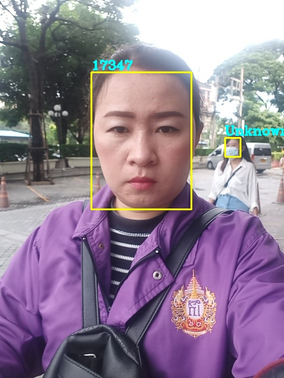

# Face Detection and Recognition

## 1. Detection
1. 使用 RetinaFace 檢測人臉框和關鍵點，再經由仿射變換對齊人臉，並 crop 成 `112 * 112`。
2. 預訓練模型（已轉為 onnx），若需手動轉，須確保 onnx 版本為 `1.5.0`。下載連結 ([微雲](https://share.weiyun.com/S0VC2Uhc))
3. 參考：[https://github.com/linghu8812/tensorrt_inference/tree/master/RetinaFace](https://github.com/linghu8812/tensorrt_inference/tree/master/RetinaFace)

### 2. Recognition
1. 使用 ArcFace 模型提取特徵，計算相似度分數。
2. 預訓練模型（已轉為 onnx）。下載連結 ([微雲](https://share.weiyun.com/UzqufBpM))
3. [配置文檔](./config_arcface.yaml)，  
```yaml
arcface:
    onnx_file:     "../arcface_r100.onnx"
    engine_file:   "../arcface_r100.trt"
    update: false
    facebank_file: "../facebank.bin"
    names_file: "../names.txt"
    facebank_dir: "./facebank"
    NUM_FACES: 10
    EMB_NUM: 512
    BATCH_SIZE:    1
    INPUT_CHANNEL: 3
    IMAGE_WIDTH:   112
    IMAGE_HEIGHT:  112
```  
- `facebank_file` 為 facebank 二進制文件路徑
- `names_file` 為 facebank 對應 face 名稱 txt 文件路徑
- `facebank_dir` 為 facebank 文件夾路徑，應包含以 face 代號命名的子文件夾
- `update` 為是否更新上述兩個文件內容，若為 `true` 則會從 `facebank_dir` 更新 `facebank` 資訊，並將結果輸出至 `facebank_file` 以及 `names_file`
4. 參考：[https://github.com/linghu8812/tensorrt_inference/tree/master/arcface](https://github.com/linghu8812/tensorrt_inference/tree/master/arcface)

3. Result

